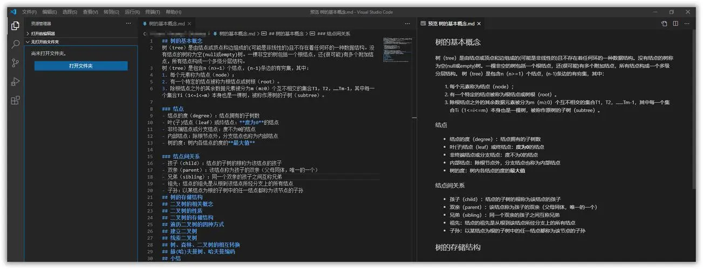
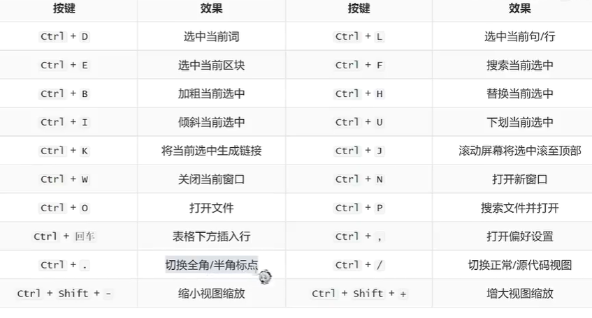

# :smile: Markdown 语法的学习  
Markdown All In One
Markdown Preview
[TOC]
## :sunny:目录
直接输入[TOC]，MPE自动帮你生成目录
## 标题
一级标题是一个# 号码+空格  
二级标题是2个##+空格  
三级标题是。。。 以此类推  
## 段落
Markdown中换行不是手动意义上的换行  

中间空一行就可以另外起一段  
中间不另外空行，可以在后面+空格2个  
就可以换段
## 强调
斜体：*这个是斜体*  
加粗：**这个是加粗**  
快捷键： ctrl+I  
删除：~~我删除这段代码~~  
高亮： ==这是一个高亮== 

## 列表
有序列表：  
1. 列表1
2. 列表2
   1. 二级标题
   2. 二级标题2
3. 哈哈哈
## 无序列表
“-”或者“+”+空格前置  
- 无序列表1
- 无序列表2
+ 这也是无序
* 这也是
## 插入图片
1. ctrl+alt+v  

   ]
2.   感叹号+中括号+小括号=插入图片
   
## 公式
$$
\alpha  = \beta+\rho  
$$
$$
\alpha^2=\beta^2+x_1
$$

## 表格
表头1|表头2|表头3
---|---|---
1.5|1.4|1.3|
ni|ha|ha

## 链接
这是一个连接：  
[学习Markdown语法的视频：](https://www.bilibili.com/video/BV1si4y1472o/?spm_id_from=333.337.search-card.all.click&vd_source=291c664176a746ee2cbcd5237b6af740)  
[连接2](https://www.bilibili.com/video/BV1hG411p7fX/?spm_id_from=333.788.recommend_more_video.-1&vd_source=291c664176a746ee2cbcd5237b6af740)：讲的是Typora 扩展可以使用Vscode  
知乎专门讲[[MPE]](https://zhuanlan.zhihu.com/p/56699805)
## 引用
>这是一个引用  
>嵌套引用
>>二级引用
>>爽死
## 分割线
你猜
***
大袋
## 代码块高亮
``` C++  

cout <<<"Hello World"<<<endl;

```

## 居中
<center>居中</center>
<u>下划线。。。</u>   

## MPE支持的各种小表情
:smile:
:cry:
:scream:
:question:
:anger:
:sparkling_heart:
其他常用的麻烦见[[链接](https://zhuanlan.zhihu.com/p/173610322)]

## 常用快捷键

## 沉浸式书写Markdown
==ctrl+k  
再按下z==